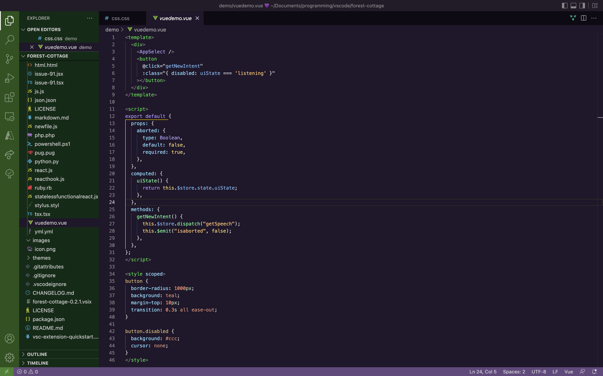
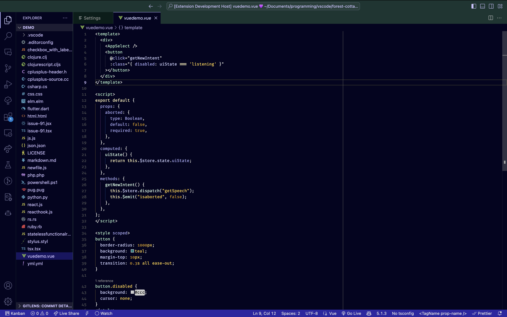
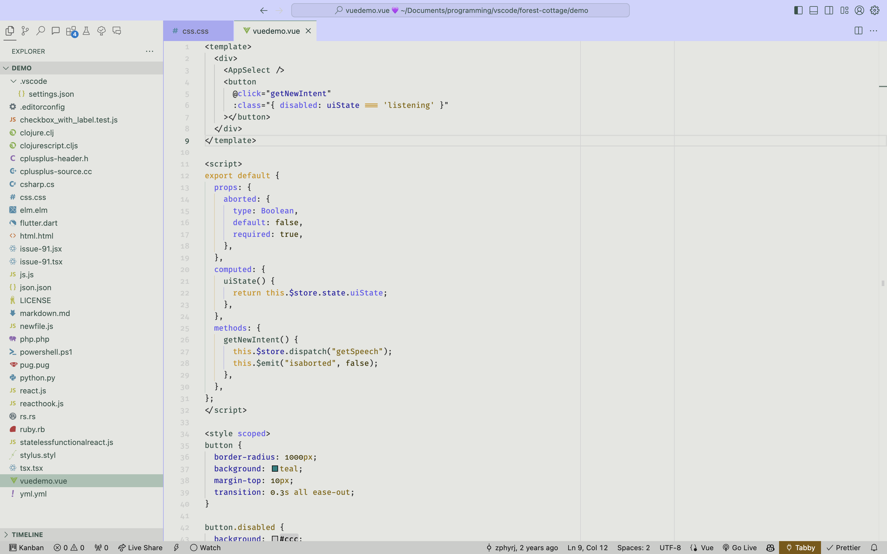
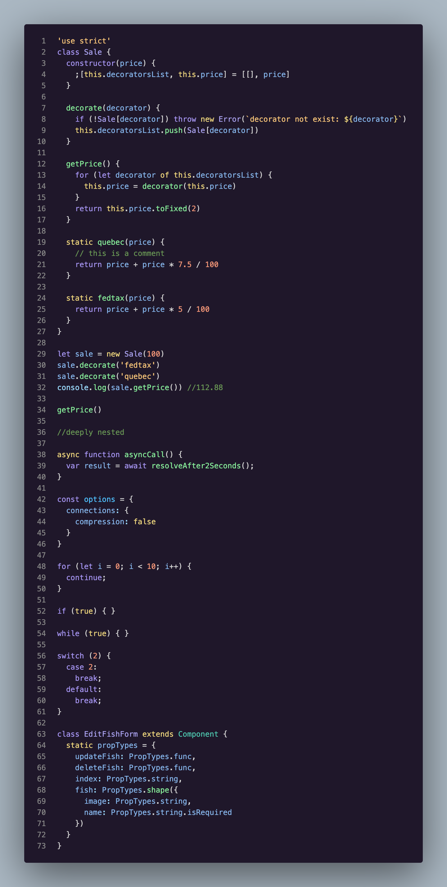
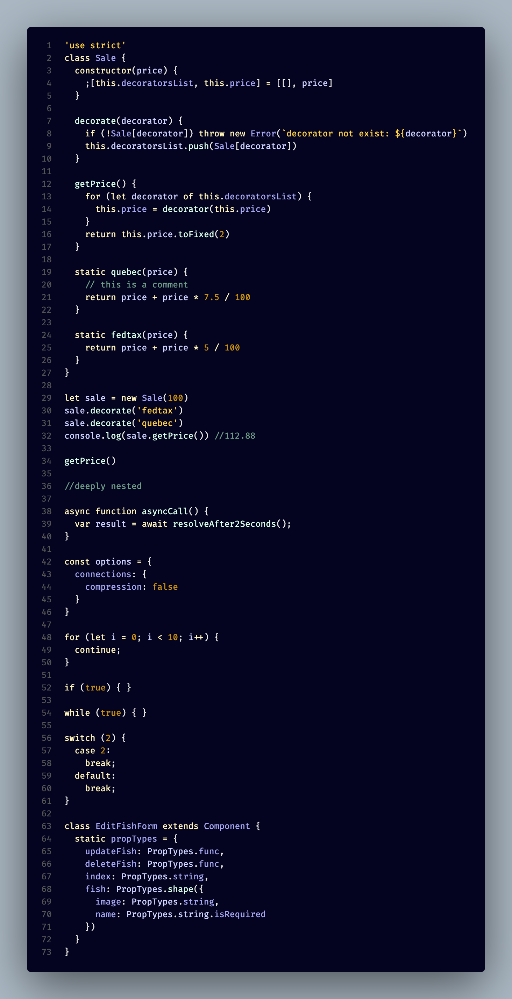
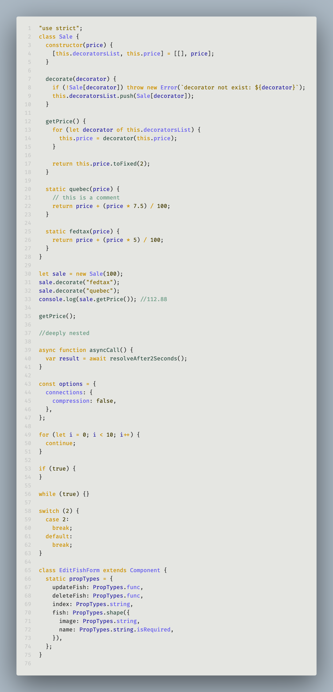
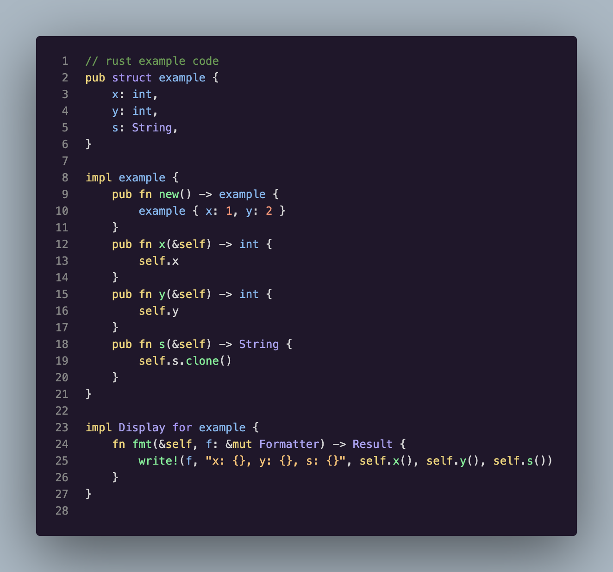
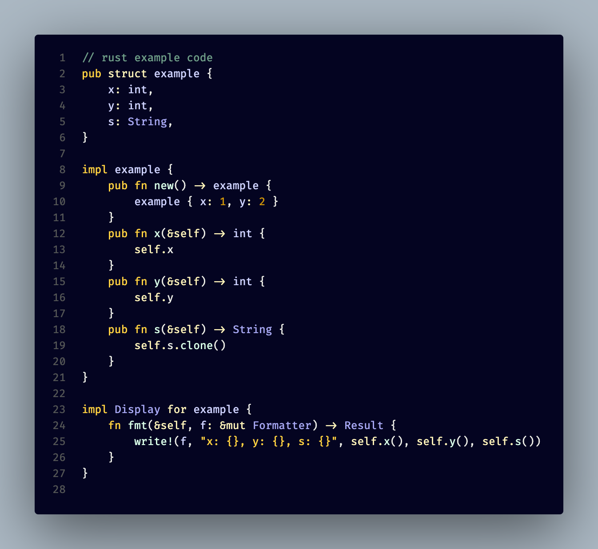
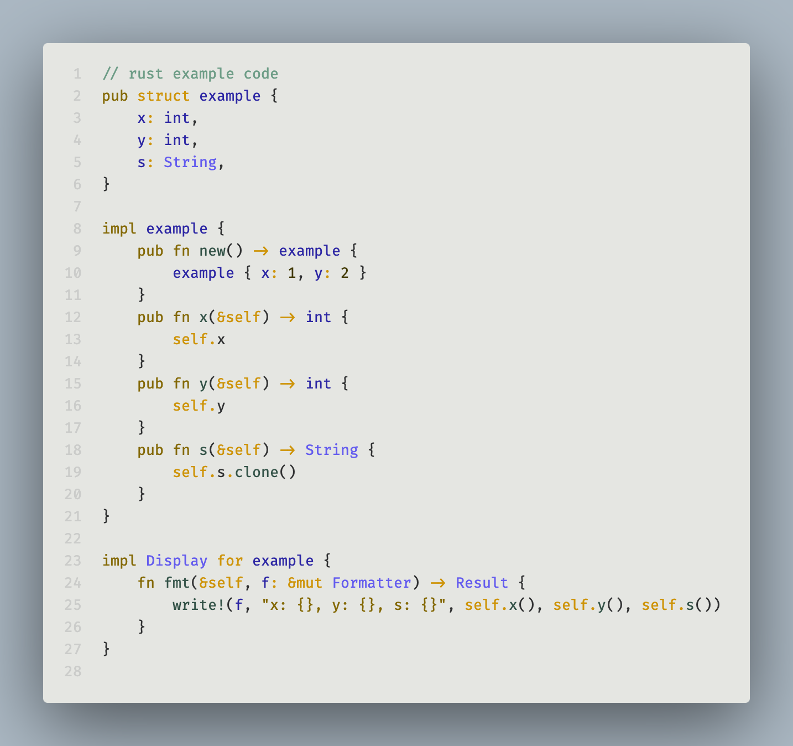

# Forest Cottage

## A foresty theme based on VSCode's Dark Themes

### Example Images

|                          |               Classic               |            Classy Dark             |               Classy Light               |
| ------------------------ | :---------------------------------: | :--------------------------------: | :--------------------------------------: |
| Default Theme Equivalent |                Dark+                |            Dark Modern             |               Light Modern               |
| Vue + VS Code UI         |  |  |  |
| JavaScript               |       |       |       |
| Rust                     |   |   |   |

### Color Inspiration for Classic

Inspired by general colors found in foresty settings like green 💚, golden yellow 💛, orange 🧡,
and purple 💜. The purple 💜 is inspired by twitter's dark blue night theme background color, just
hue shifted. The green 💚 is another hue-shift of twitter's dark blue. The golden yellow is just a
color that I enjoy in between yellow 💛 and orange 🧡.

### Color Inspiration for Classy

Similarly inspired by colors found in foresty settings, but more of a coastal forest inspiration
with seafoam green 🌊💚, golden yellow ⭐️💛, rusted red 🧱❤️, and moon-lit blueish purple 🌑💜.

The light theme is based off of the dark theme, with slight adjustments to color due to perceptual
color differences which occur when colors are against a light background vs a dark background. The other
difference between the two is that the primary color for the dark theme is the purple with the 
secondary color being green and vice versa for the light mode.

Colors were hand selected using [palettte.app](https://palettte.app) - you can find the palettte
JSON for import into palettte [here](./themes/palettteImport.json).

## Credits

Demo folder from [Night Owl theme](https://github.com/sdras/night-owl-vscode-theme) by Sarah Drasner.

[CSS-Tricks article on the creation of the Night Owl theme](https://css-tricks.com/creating-a-vs-code-theme/)
