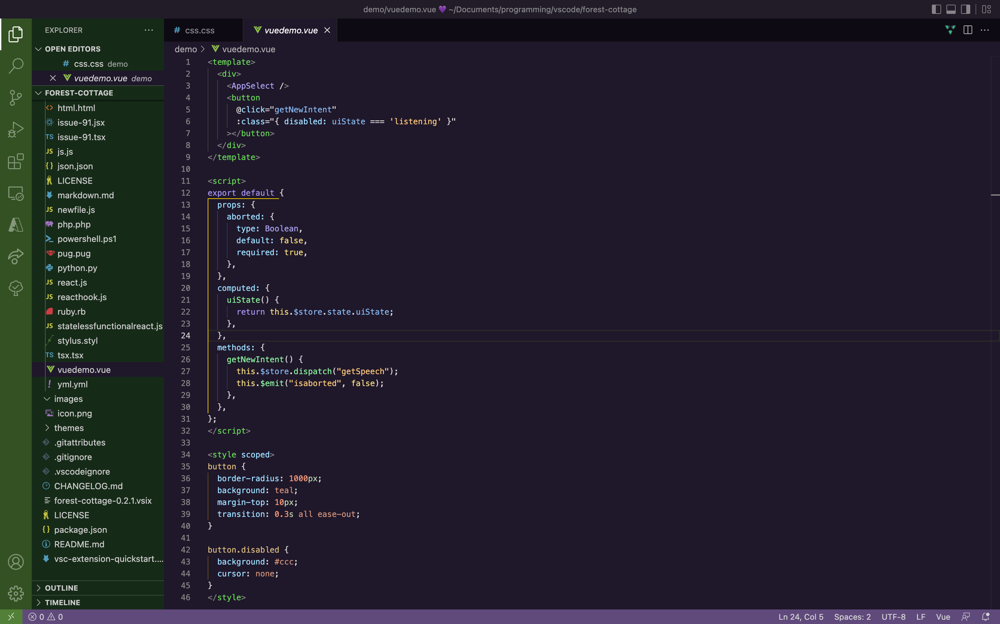
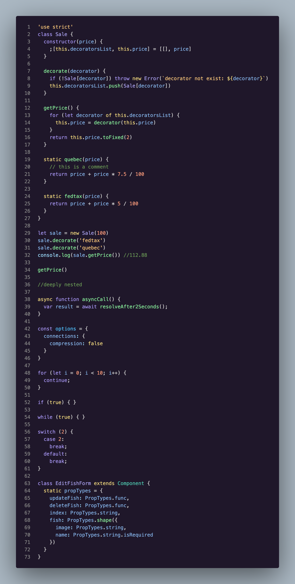
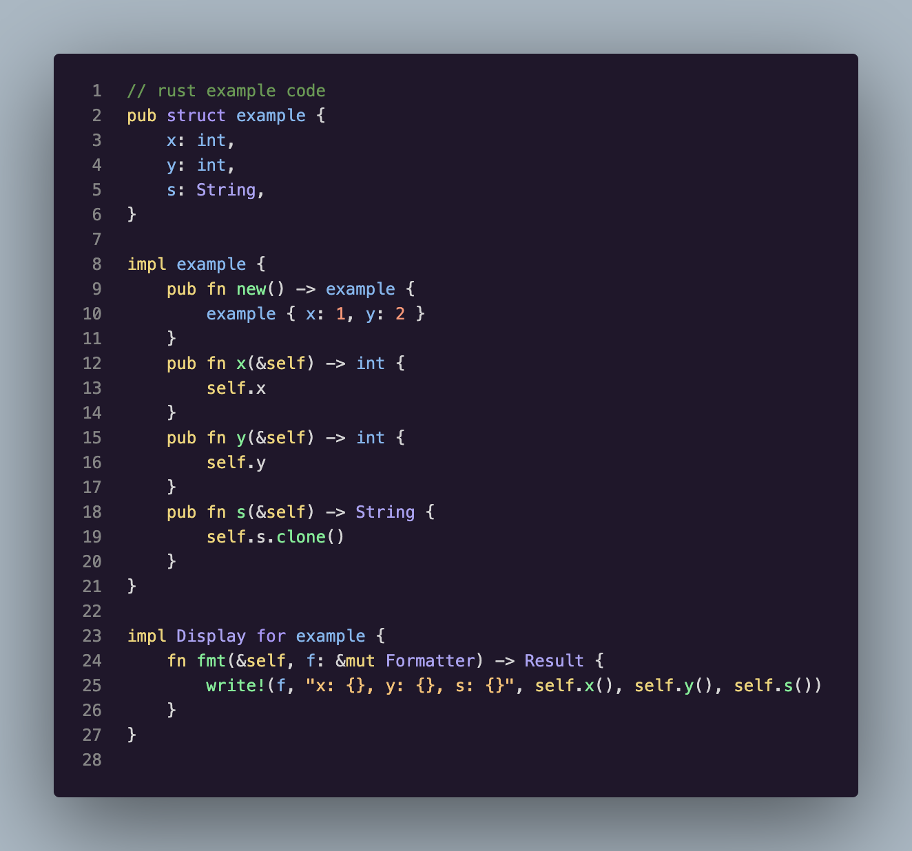

# Forest Cottage

## A foresty theme based on VSCode's Dark+ Theme

### Example Images

#### Vue/all of VSCode

#### JavaScript

#### Rust

### Color Inspiration

Inspired by general colors found in foresty settings like green 💚, golden yellow 💛, orange 🧡, and purple 💜. The purple 💜 is inspired by twitter's dark blue night theme background color, just hue shifted. The green 💚 is another hue-shift of twitter's dark blue. The golden yellow is just a color that I enjoy in between yellow 💛 and orange 🧡.

## Credits

Demo folder from [Night Owl theme](https://github.com/sdras/night-owl-vscode-theme) by Sarah Drasner.

[CSS-Tricks article on the creation of the Night Owl theme](https://css-tricks.com/creating-a-vs-code-theme/)
